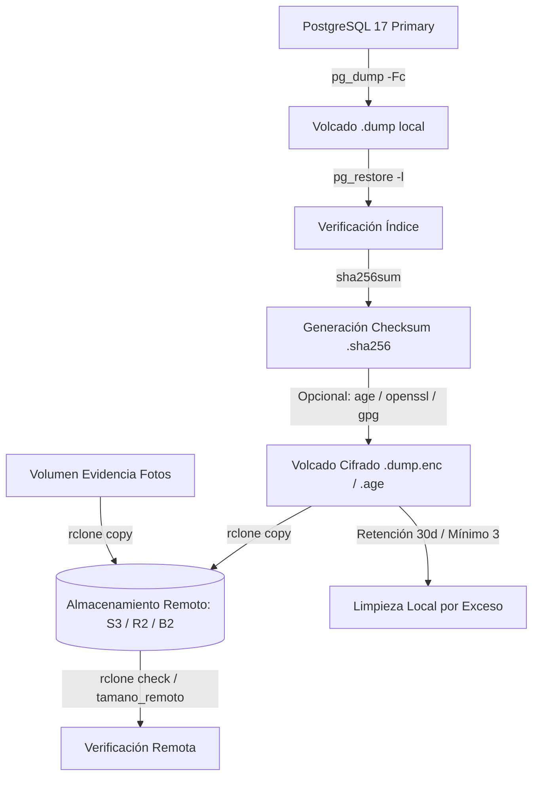

# Manual de Operaciones: Respaldos y Restauración de SentryCore

> **Issue #24 / #224**: Respaldo diario automatizado, copia externa fuera del VPS,
> cifrado de datos en reposo, verificación criptográfica de integridad SHA-256,
> preservación de políticas de seguridad multi-tenant (RLS ENABLE y FORCE),
> restauración comprobada y arranque verificado de la API.

---

## 1. Arquitectura de Respaldos

El servicio `postgres-backup` corre en Docker (`docker-compose.dokploy.yml` y `docker-compose.production.yml`)
utilizando la imagen basada en `docker/postgres/backup/Dockerfile` (`postgres:17-alpine` con `rclone`, `tzdata`, `openssl`, `age` y `gnupg`).



### Componentes Clave:
1. **Base de datos PostgreSQL**:
   - `pg_dump -Fc` con el usuario dueño (`POSTGRES_USER`).
   - **Nunca** usa `sentrycore_app`: el usuario de la aplicación tiene RLS estricto y sin contexto de tenant el volcado resultaría vacío.
   - Escritura atómica a `*.part` y renombramiento final para evitar archivos corruptos ante cortes de energía o reinicios.
   - Validación inmediata del catálogo con `pg_restore -l`.
2. **Integridad Criptográfica**:
   - Generación de hashes `SHA-256` para cada archivo de volcado antes y después del cifrado.
   - Verificación automatizada previa a cualquier proceso de restauración.
3. **Cifrado en Reposo**:
   - **OpenSSL**: Cifrado simétrico AES-256-CBC con derivación PBKDF2 y 100.000 iteraciones (`.dump.enc`).
   - **age**: Cifrado asimétrico moderno con claves públicas (`age1...`) y privadas (`.dump.age`).
   - **GPG**: Cifrado simétrico o asimétrico estándar (`.dump.gpg`).
4. **Copia Externa Fuera del VPS**:
   - Transferencia vía `rclone copy` (nunca `sync`, para evitar propagación de borrados accidentales).
   - Compatible con Cloudflare R2, AWS S3, Backblaze B2, MinIO y SFTP.
   - Verificación de tamaño de bytes y checksums en el destino remoto.
5. **Evidencia Fotográfica**:
   - Respaldo incremental de fotos asociadas a rondas de guardia.
   - Validación integral mediante `rclone check --one-way`.
6. **Seguridad Multi-Tenant (RLS)**:
   - Preservación estricta de `ROW LEVEL SECURITY ENABLE` y `ROW LEVEL SECURITY FORCE` en todas las tablas con `tenant_id`.
   - Garantía de que funciones de seguridad (`app_tenant_id()`, `app_has_audited_support_access()`) y permisos `GRANT` para `sentrycore_app` se restauran intactos.

---

## 2. Variables de Entorno y Configuración de Secretos

Siguiendo la **Regla 5 de SentryCore**, ninguna credencial ni clave de cifrado se registra en logs ni se incluye en el código fuente.

### Variables del Servicio de Respaldo

| Variable | Descripción | Valor por defecto |
|---|---|---|
| `TZ` | Zona horaria para el cálculo de calendario | `America/Santiago` |
| `BACKUP_HORA` | Hora programada para el volcado diario | `04:00` |
| `BACKUP_AL_ARRANCAR` | Ejecuta respaldo si falta el del día al iniciar | `si` |
| `BACKUP_RETENTION_DAYS`| Días de retención en el volumen local | `30` |
| `BACKUP_MINIMO_LOCAL` | Piso mínimo de respaldos en disco | `3` |
| `BACKUP_COPIAR_EVIDENCIA` | Respaldar volumen de evidencia fotográfica | `si` |
| `BACKUP_REMOTE` | Destino base de rclone | _(vacío = sólo local)_ |
| `BACKUP_ENCRYPTION_TOOL` | Herramienta de cifrado (`none`, `openssl`, `age`, `gpg`, `auto`) | `auto` |
| `BACKUP_ENCRYPTION_PASSPHRASE`| Clave simétrica compartida para OpenSSL / GPG | _(vacío)_ |
| `BACKUP_OPENSSL_PASSPHRASE` | Clave específica para OpenSSL | _(vacío)_ |
| `BACKUP_AGE_RECIPIENT` | Clave pública age del destinatario (`age1...`) | _(vacío)_ |
| `BACKUP_AGE_IDENTITY` | Clave privada age para descifrado (`AGE-SECRET-KEY-1...`) | _(vacío)_ |

### Configuración de Almacenamiento Remoto (rclone)

Las credenciales se configuran mediante variables de entorno `RCLONE_CONFIG_<NOMBRE>_*` en el gestor de Dokploy:

#### Cloudflare R2:
```bash
BACKUP_REMOTE=r2:sentrycore-respaldos
RCLONE_CONFIG_R2_TYPE=s3
RCLONE_CONFIG_R2_PROVIDER=Cloudflare
RCLONE_CONFIG_R2_ENDPOINT=https://<account_id>.r2.cloudflarestorage.com
RCLONE_CONFIG_R2_REGION=auto
RCLONE_CONFIG_R2_ACCESS_KEY_ID=<access_key_id>
RCLONE_CONFIG_R2_SECRET_ACCESS_KEY=<secret_access_key>
```

#### AWS S3:
```bash
BACKUP_REMOTE=s3:sentrycore-respaldos
RCLONE_CONFIG_S3_TYPE=s3
RCLONE_CONFIG_S3_PROVIDER=AWS
RCLONE_CONFIG_S3_REGION=us-east-1
RCLONE_CONFIG_S3_ACCESS_KEY_ID=<access_key_id>
RCLONE_CONFIG_S3_SECRET_ACCESS_KEY=<secret_access_key>
```

---

## 3. Guía de Ejecución y Scripts Disponibles

Los scripts residen en `docker/postgres/backup/` y se pueden invocar desde el contenedor o mediante los asistentes en `scripts/`.

### Ejecución Manual desde el Host

```bash
# 1. Ejecutar respaldo inmediato (base de datos + fotos + cifrado + subida remota)
./scripts/backup.sh

# 2. Verificar existencia del respaldo de ayer fuera del VPS
docker compose -f docker-compose.dokploy.yml exec postgres-backup \
  sh /scripts/verificar-copia-remota.sh

# 3. Probar restauración en base de prueba temporal con verificación RLS completa
./scripts/verificar-restore.sh sentrycore_verificacion_restore
```

---

## 4. Procedimiento de Recuperación ante Desastres (Disaster Recovery Runbook)

En caso de fallo catastrófico del VPS o pérdida total de datos:

### Paso 1: Aprovisionar Stack y Volúmenes Limpios
```bash
docker compose -f docker-compose.dokploy.yml up -d postgres redis
```

### Paso 2: Descargar el Respaldo Remoto
```bash
# Descargar el volcado y su checksum desde el almacenamiento seguro
docker compose -f docker-compose.dokploy.yml exec postgres-backup \
  sh -c 'rclone copy "$BACKUP_REMOTE/postgres/sentrycore-2026-08-18.dump.enc" /backups/'
docker compose -f docker-compose.dokploy.yml exec postgres-backup \
  sh -c 'rclone copy "$BACKUP_REMOTE/postgres/sentrycore-2026-08-18.dump.enc.sha256" /backups/'
```

### Paso 3: Restaurar la Base de Datos
```bash
# Para restaurar sobre una base de prueba:
docker compose -f docker-compose.dokploy.yml exec postgres-backup \
  sh /scripts/restore.sh /backups/sentrycore-2026-08-18.dump.enc sentrycore_restore

# Para restaurar sobre la base productiva en un desastre real:
docker compose -f docker-compose.dokploy.yml exec \
  -e CONFIRMO_RESTORE_PRODUCTIVO=si postgres-backup \
  sh /scripts/restore.sh /backups/sentrycore-2026-08-18.dump.enc sentrycore
```
*Nota: El script valida automáticamente el hash SHA-256, detecta el cifrado (.enc / .age / .gpg), descifra en memoria temporal, comprueba el catálogo `pg_restore -l` y ejecuta la restauración con `--clean --if-exists`.*

### Paso 4: Restaurar la Evidencia Fotográfica
```bash
# Restaurar fotos al volumen de evidencias
docker compose -f docker-compose.dokploy.yml exec \
  -e CONFIRMO_RESTORE_PRODUCTIVO=si postgres-backup \
  sh /scripts/restaurar-evidencia.sh /evidencia
```

### Paso 5: Iniciar la API y Verificar Salud
```bash
docker compose -f docker-compose.dokploy.yml up -d api web
curl --fail http://127.0.0.1:3001/health
curl --fail http://127.0.0.1:3001/ready
```

---

## 5. Qué Valida la Comprobación Automatizada de Restore

`verificar-restore.sh` y el workflow de CI (`.github/workflows/backup-restore.yml`) comprueban:

1. **Conteo de Tablas**: Coincidencia exacta de tablas en esquema `public`.
2. **Políticas de Aislamiento RLS**:
   - `RLS ENABLE` y `RLS FORCE` en **todas** las tablas que contienen `tenant_id`.
   - Comparación exacta de expresiones `USING` y `WITH CHECK`.
3. **Funciones de Seguridad**:
   - Presencia y ejecución de `app_tenant_id()` y `app_has_audited_support_access()`.
4. **Prueba de Aislamiento en Runtime**:
   - Consulta con el rol de aplicación `sentrycore_app` (NO superusuario).
   - Verificación de que sin contexto de tenant devuelve `0` filas (**falla cerrada**).
   - Verificación de que con contexto de tenant sólo se leen registros del tenant asignado.
5. **Permisos y Privilegios**:
   - Permisos `GRANT` sobre tablas para el rol `sentrycore_app`.
6. **Conteo de Registros**:
   - Comparación fila por fila en todas las tablas entre origen y destino.
7. **Arranque de API y Autenticación**:
   - La API inicia sobre la base restaurada y ejecuta login real con contraseñas demo.
